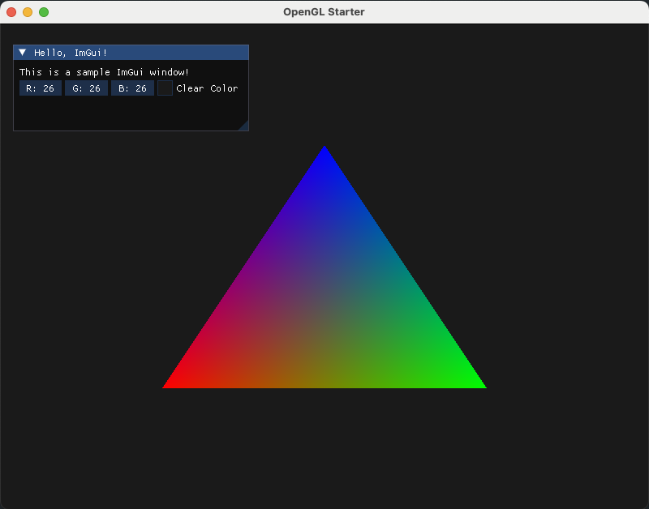

# OpenGL Starter

Just some essential boilerplate to get you going with opengl.
Made for the tutorial at learnopengl.com



## Whats Included?

- glfw
- glad
- glm (math library)
- stb_image.h (image loading)
- ImGui (UI)
- Simple Shader Loader

## Getting Started

```
git clone https://github.com/grplyler/opengl-starter.git
cd opengl-starter
./bootstrap.sh
```

**Build**

```
./b
```

**Run**
```
./r
```

If you see a red window, everythings working.

## Todo

- [ ] Basic shader loader
